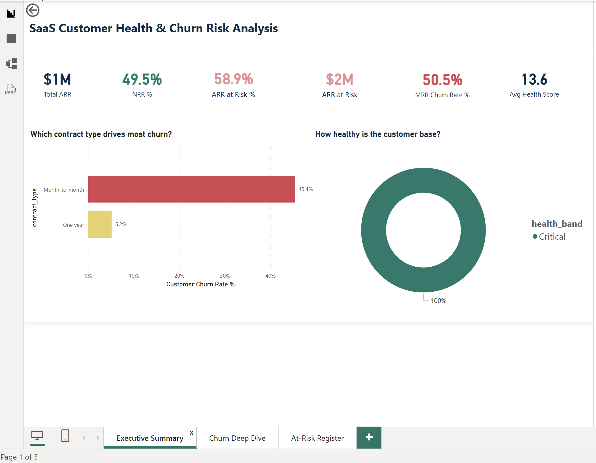
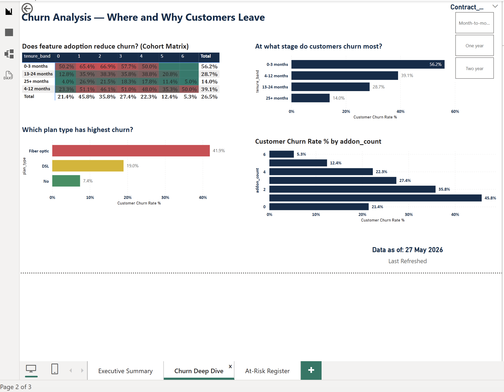
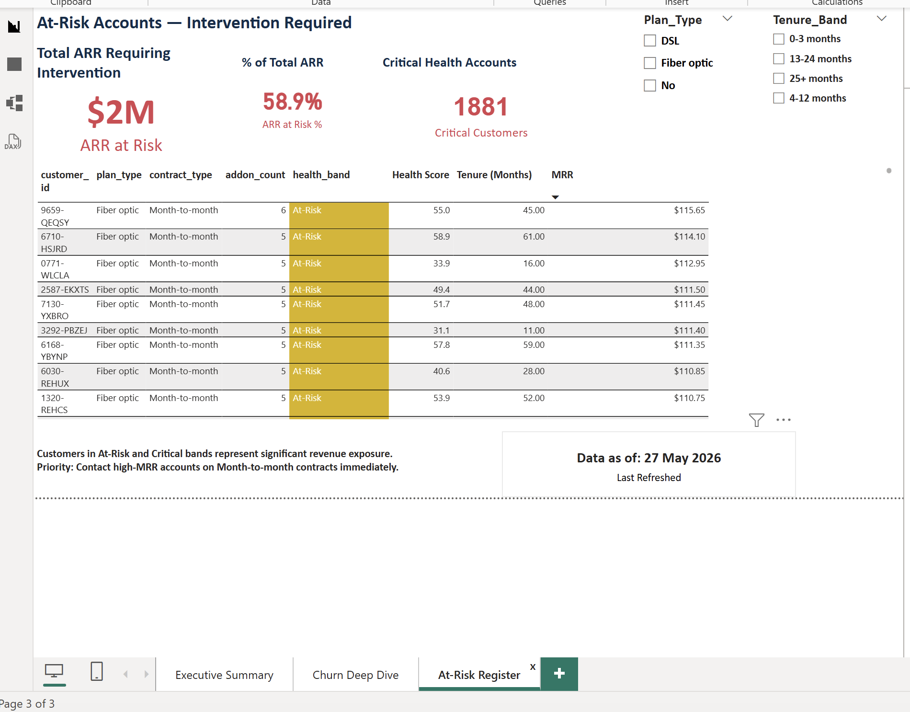
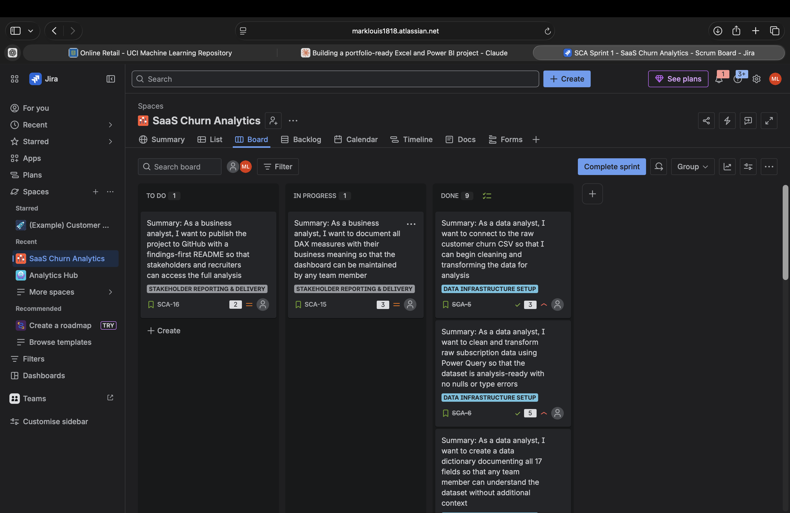
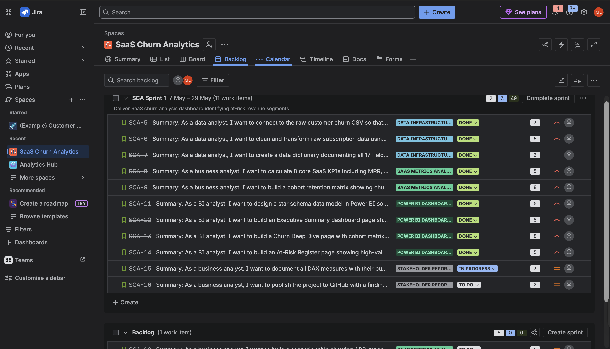
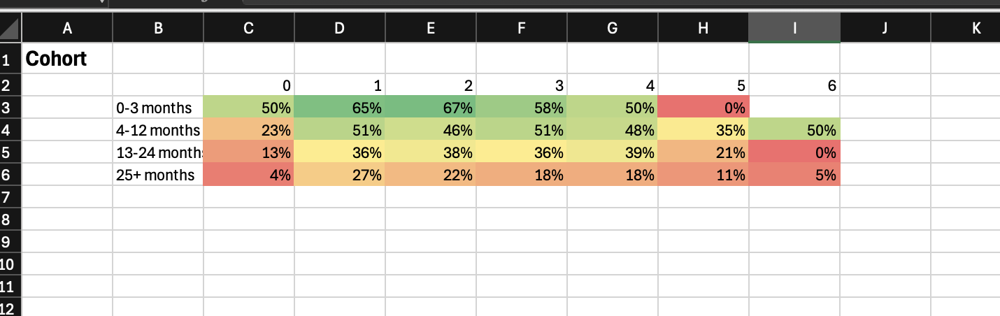

# SaaS Customer Health & Churn Risk Analysis


> **Business question:** Which customer segments carry the highest churn risk,
> and what ARR is at stake without intervention?



---

## Key Findings

- **59% of total ARR** sits in At-Risk or Critical accounts
- Month-to-month customers churn at **42.7%** versus just **2.8%** for
  two-year contracts — a 15× difference
- Fiber optic customers churn at **57.9%** — more than 3× the DSL rate
  of 17.6%
- Customers with zero add-ons in months 0-3 churn at **52%** — suggesting
  onboarding drives retention more than product features
- Reducing churn from 31% to 20% is worth **$554,178** in additional
  lifetime value across the customer base

---

## Dashboard




---

## Project Management — JIRA

This project was managed end-to-end using **Agile/Scrum methodology in JIRA**.
Work was broken into 4 epics and 12 user stories across a 3-week sprint,
reflecting how analytical projects are delivered in real teams.



| Sprint metric | Value |
|---------------|-------|
| Sprint duration | 3 weeks (8 May – 29 May 2026) |
| Total story points | 59 |
| Points completed | 57 (97%) |
| Epics | 4 |
| User stories | 12 |

**Epics:**
- Data Infrastructure Setup — connect, clean, and document source data
- SaaS Metrics Analysis — calculate KPIs, cohort matrix, scenario tables
- Power BI Dashboard Development — build 3-page interactive dashboard
- Stakeholder Reporting & Delivery — document DAX, publish to GitHub

**Full JIRA documentation:** [jira/jira_project_setup.md](jira/jira_project_setup.md)



---

## Tools & Skills Demonstrated

| Tool | Techniques |
|------|-----------|
| Excel | Power Query (M code), LET formulas, cohort retention matrix, SUMIFS/COUNTIFS, Data Tables for scenario analysis |
| Power BI | DAX measures (CALCULATE, DIVIDE, ALL), conditional formatting, drillthrough, bookmarks, slicers |
| JIRA | Agile project management — Scrum board, epics, user stories with acceptance criteria, sprint planning, velocity tracking |
| GitHub | Version control, technical documentation, markdown reporting |

---

## Project Structure

```
saas-churn-analytics/
├── data/
│   └── raw/               ← Original IBM Telco Churn dataset
├── excel/
│   └── saas_churn_model.xlsx
├── powerbi/
│   ├── saas_dashboard.pbix
│   └── dax_measures.md    ← Every DAX measure documented
├── jira/
│   ├── jira_project_setup.md  ← Sprint setup, epics, stories
│   └── screenshots/           ← Board, backlog, story detail
├── docs/
│   └── screenshots/       ← Dashboard screenshots
```

---

## Excel Model Highlights

- **Power Query** — 14-step transformation pipeline with named steps,
  null handling, and calculated columns
- **Cohort matrix** — churn rate by tenure band × addon count,
  color-coded heatmap
- **8 SaaS KPIs** — MRR, ARR, NRR, LTV, churn rates, health score
- **Scenario tables** — what-if analysis showing value of churn
  reduction at different ARPU levels



---

## How to Use

1. Download `data/raw/WA_Fn-UseC_-Telco-Customer-Churn.csv`
2. Open `excel/saas_churn_model.xlsx` — start on the `_README` tab
3. Open `powerbi/saas_dashboard.pbix` in Power BI Desktop
4. Read `powerbi/dax_measures.md` for DAX documentation
5. View `jira/jira_project_setup.md` for project management context

---

## Data Source

IBM Telco Customer Churn dataset reframed to SaaS subscription context.
Columns renamed to reflect SaaS terminology (tenure → months_subscribed,
MonthlyCharges → mrr, etc).

Original source: https://www.kaggle.com/datasets/blastchar/telco-customer-churn
