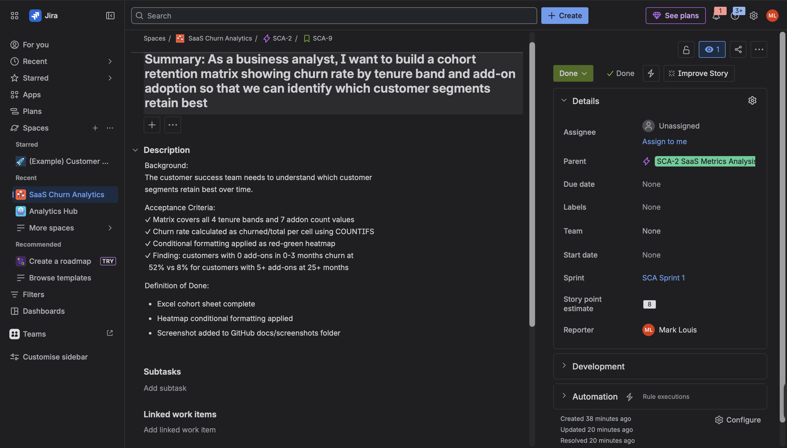
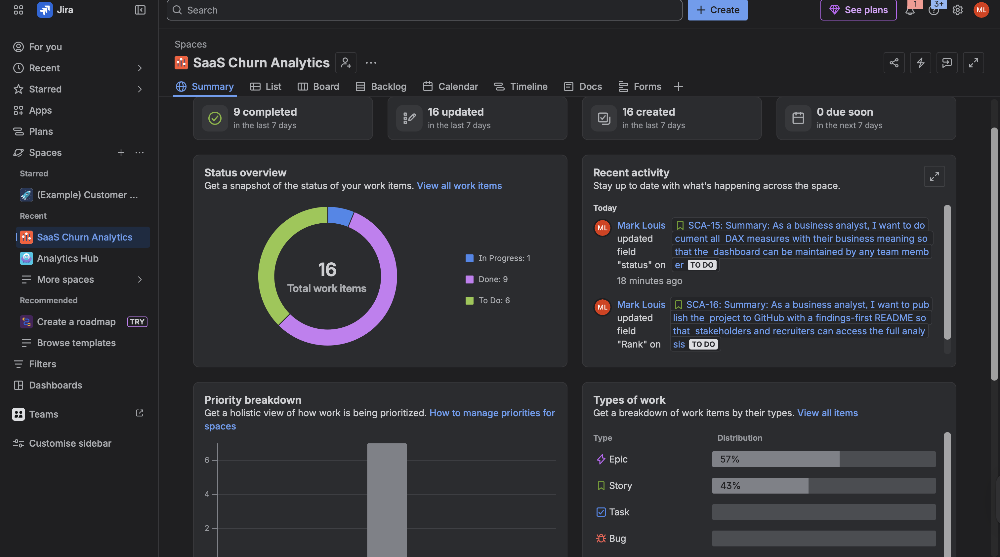

# JIRA Project Setup — SaaS Churn Analytics

## Project details
- **Project name:** SaaS Churn Analytics
- **Project key:** SCA
- **Methodology:** Scrum
- **Sprint duration:** 3 weeks
- **Sprint goal:** Deliver SaaS churn analysis dashboard 
  identifying at-risk revenue segments

---

## Epics

| Epic | Description | Stories |
|------|-------------|---------|
| Data Infrastructure Setup | Connect, clean, and document source data | SCA-5, SCA-6, SCA-7 |
| SaaS Metrics Analysis | Calculate KPIs, cohort analysis, scenarios | SCA-8, SCA-9, SCA-10 |
| Power BI Dashboard Development | Build 3-page interactive dashboard | SCA-11, SCA-12, SCA-13, SCA-14 |
| Stakeholder Reporting & Delivery | Document and publish findings | SCA-15, SCA-16 |

---

## Sprint 1 — Story summary

| ID | Story | Points | Status |
|----|-------|--------|--------|
| SCA-5 | Connect to raw customer churn CSV | 3 | Done |
| SCA-6 | Clean and transform data using Power Query | 5 | Done |
| SCA-7 | Create data dictionary for all 17 fields | 2 | Done |
| SCA-8 | Calculate 8 core SaaS KPIs | 5 | Done |
| SCA-9 | Build cohort retention matrix | 8 | Done |
| SCA-11 | Design star schema data model | 5 | Done |
| SCA-12 | Build Executive Summary dashboard page | 8 | Done |
| SCA-13 | Build Churn Deep Dive dashboard page | 8 | Done |
| SCA-14 | Build At-Risk Register dashboard page | 5 | Done |
| SCA-15 | Document all DAX measures | 3 | In Progress |
| SCA-16 | Publish to GitHub with findings README | 2 | To Do |

**Total story points completed: 57 of 59**

---

## Screenshots

---

## Why JIRA for an analytics project

In a real analytics team every piece of work is tracked as
a user story with acceptance criteria. This ensures:
- Stakeholders know exactly what is being built and why
- Analysts have clear definition of done for each task
- Sprint velocity can be measured and improved over time
- Work is prioritised by business value not personal preference
